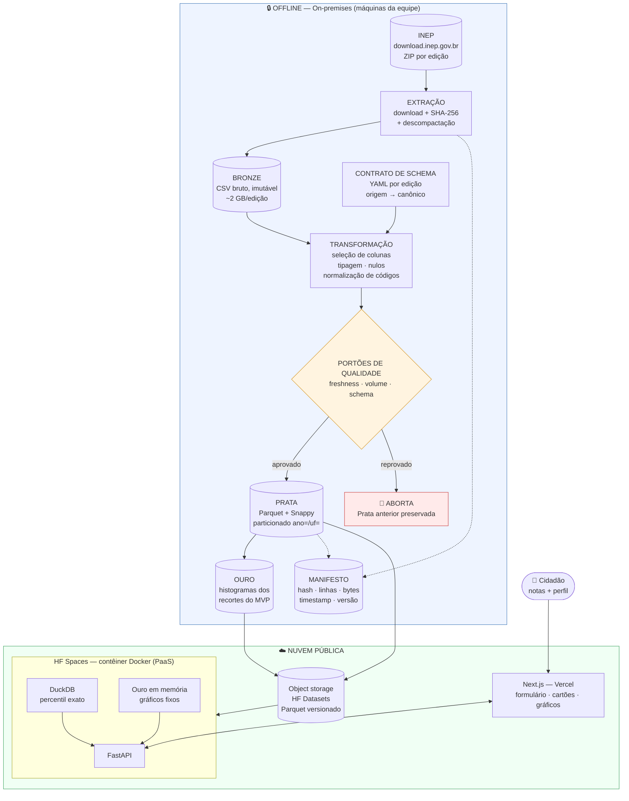

# Plano de Implementação — StartINEP / Radar ENEM

**Projeto Aplicado III — Bacharelado em Ciência de Dados e Inteligência Artificial (4ª Fase, 2026/2)**
Centro Universitário SENAI SC — Campus Florianópolis
Orientador: Gustavo Stangherlin Cantarelli

| | |
|---|---|
| **Produto** | StartINEP — ENEM em Foco: Sua nota conta, o contexto revela. |
| **Escopo de dados** | Microdados ENEM 2024 e 2025 (INEP) |
| **Data deste plano** | 08/09/2026 |
| **Status** | AV1 entregue em 25/08. Próximo marco: AV2 em 28/09. |

> Este documento é o plano **técnico** de execução. Ele detalha e operacionaliza o
> Plano de Trabalho oficial (AV1), sem substituí-lo. Quando houver divergência,
> o Plano de Trabalho prevalece como compromisso institucional e este documento
> deve ser corrigido.

---

## Sumário

1. [Decisões arquiteturais fechadas](#1-decisões-arquiteturais-fechadas)
2. [Estrutura de pastas do repositório](#2-estrutura-de-pastas-do-repositório)
3. [Arquitetura de ponta a ponta](#3-arquitetura-de-ponta-a-ponta)
4. [Justificativa pelos 5 Vs do Big Data](#4-justificativa-pelos-5-vs-do-big-data)
5. [Stack tecnológica](#5-stack-tecnológica)
6. [Motor estatístico — especificação](#6-motor-estatístico--especificação)
7. [Roadmap por sprints, amarrado às AV1–AV7](#7-roadmap-por-sprints-amarrado-às-av1av7)
8. [Riscos técnicos e mitigações](#8-riscos-técnicos-e-mitigações)
9. [Convenções de trabalho em equipe](#9-convenções-de-trabalho-em-equipe)
10. [Onde cada unidade curricular é evidenciada](#10-onde-cada-unidade-curricular-é-evidenciada)

---

## 1. Decisões arquiteturais fechadas

Três decisões estruturais foram deliberadas e aprovadas antes do início da
implementação. Todas as demais escolhas deste plano derivam delas.

### D1 — Motor estatístico híbrido (Prata + Ouro)

O cálculo estatístico usa **duas camadas complementares**:

- **Fonte da verdade:** consulta ao vivo em Parquet via **DuckDB** embarcado na API.
  Permite recorte arbitrário e percentil exato sobre a distribuição real.
- **Camada Ouro (cache derivado):** histogramas pré-agregados, calculados offline no
  pipeline, cobrindo os recortes que a interface do MVP efetivamente expõe.

A camada Ouro **não é uma segunda verdade** — é integralmente derivável do Parquet e
regenerada a cada execução do pipeline. Qualquer divergência entre Ouro e Prata é um
defeito, e existe um teste automatizado para detectá-la (ver §6.4).

**Escopo inicial da camada Ouro (decisão de contenção):** apenas os recortes expostos
na interface do MVP. Não haverá tentativa de pré-agregar a combinatória completa de
recortes nesta fase. A expansão para cruzamentos adicionais fica como trabalho
oportunista, condicionado a folga de cronograma após a Sprint 4.

**Por que híbrido e não só um dos dois:** o cubo puro colapsa sob explosão combinatória
assim que o usuário pode cruzar região × renda × tipo de escola × cor/raça, e degrada
"percentil exato" para "exato até a resolução do bin". A consulta pura em Parquet resolve
isso, mas paga I/O em toda requisição, inclusive nos gráficos fixos do dashboard, que são
idênticos para todos os usuários. O híbrido usa cada um onde ele é forte, e ainda produz
a narrativa **Bronze → Prata → Ouro** da arquitetura Medalhão de ponta a ponta.

### D2 — Nuvem híbrida: ingestão on-premises, aplicação em nuvem pública

| Componente | Modelo de implantação | Modelo de serviço | Justificativa |
|---|---|---|---|
| Pipeline de ingestão/ETL | Privado / on-premises (máquinas da equipe) | — | Carga **esporádica**: roda ~3× por edição. Provisionar computação elástica para um job que executa três vezes no semestre é desperdício de OPEX — é o exercício de dimensionamento da Aula 4 aplicado ao contrário. |
| API estatística (FastAPI + DuckDB) | Nuvem pública | **PaaS / CaaS** | Entregamos a imagem Docker; a plataforma administra SO, runtime e disponibilidade. Reduz esforço operacional de uma equipe de 4 estudantes sem infra dedicada. |
| Interface web (Next.js) | Nuvem pública | **PaaS** | Build e CDN gerenciados, deploy automático por push. |
| Artefato Parquet versionado | Nuvem pública | Object storage | Distribuição do dado tratado, desacoplada do build da aplicação. |

O conjunto caracteriza uma **nuvem híbrida**: processamento pesado em ambiente privado
controlado, entrega em nuvem pública elástica.

**Provedores escolhidos:**

- **Hugging Face Spaces (SDK Docker)** — hospedagem da API. Gratuito, **sem exigência de
  cartão de crédito**, URL pública permanente, 16 GB de RAM e 2 vCPU no tier gratuito.
  É Docker real: consome exatamente a imagem construída na Aula 3.
- **Vercel (Hobby)** — hospedagem do front-end Next.js. Gratuito, sem cartão, deploy por push.
- **Hugging Face Datasets** — armazenamento versionado do artefato Parquet.

> **⚠️ Cold start — procedimento obrigatório antes de apresentação.** O tier gratuito do
> HF Spaces **hiberna por inatividade**, e o primeiro acesso após a hibernação leva
> **30–60 segundos**. Isso é inaceitável diante de uma banca. Antes de **AV2 (28/09)** e de
> **AV7 (01/12)**, um integrante designado deve acessar a aplicação com **no mínimo 15
> minutos de antecedência** para acordar o serviço, e reacessá-la a cada ~10 minutos até o
> início da apresentação. Isto entra como item de checklist nas Sprints 2 e 7, com responsável
> nomeado — não como lembrete informal.

**Deploy IaaS em VM — escopo restrito.** A prática da Aula 5 (provisionar VM, instalar
Docker, subir contêiner) será executada e documentada como **evidência da disciplina de
Computação em Nuvem**, restrita a **demonstrar a execução do pipeline de ingestão** em
IaaS. A VM **não hospeda a stack de produção** e a nota do AV6 não depende dela. Isso
protege a entrega contra recuperação de instância pelo provedor, expiração de crédito
institucional ou indisponibilidade de capacidade — modos de falha comuns em tiers
gratuitos de IaaS.

**Responsabilidade compartilhada (segurança DA nuvem × NA nuvem):**

| Segurança **DA** nuvem (provedor) | Segurança **NA** nuvem (equipe) |
|---|---|
| Data center, hardware, energia, refrigeração | Ausência de segredos no código versionado |
| Hipervisor e camada de virtualização | Configuração de CORS e superfície da API |
| Disponibilidade da plataforma e do runtime gerenciado | Validação de entrada e tratamento de exceções |
| Isolamento entre contêineres de tenants distintos | Conformidade do uso dos dados com o RIPD do INEP |

O projeto **não coleta nem persiste dados pessoais do usuário final**. As notas e o perfil
informados são processados em memória, na requisição, e descartados — nada é gravado. Essa
decisão elimina a maior parte da superfície de exposição LGPD e é um requisito de projeto,
não uma otimização.

### D3 — Monorepo com API e front separados

Monorepo único no GitHub, com `api/` (FastAPI — João Pedro Silva) e `web/` (Next.js —
Benvenutti) como aplicações independentes. Espelha a divisão de papéis já formalizada no
Plano de Trabalho.

**Custo assumido conscientemente:** configuração de CORS e dois pipelines de deploy. A
alternativa (Streamlit, tudo num contêiner) seria mais simples de operar, mas contraria a
atribuição de front-end registrada no AV1 e reduziria a evidência de desenvolvimento web
para a banca.

---

## 2. Estrutura de pastas do repositório

```text
StartINEP---ENEM-em-Foco/
│
├── README.md                        # Visão do produto + link público da aplicação (AV6)
├── PLANO_IMPLEMENTACAO.md           # Este documento
├── Makefile                         # Atalhos: make ingest / make test / make up
├── docker-compose.yml               # Sobe api + web para desenvolvimento local
├── .gitignore
├── .github/
│   └── workflows/
│       ├── ci.yml                   # Lint + testes em cada PR
│       └── deploy-api.yml           # Push da imagem para o HF Space
│
├── data/                            # ❌ NÃO versionado (ver §9.4)
│   ├── bronze/                      # ZIPs e CSVs originais do INEP, intocados
│   │   └── enem_2024/ enem_2025/
│   ├── silver/                      # Parquet limpo, particionado ano=/uf=
│   │   └── ano=2024/uf=SC/*.parquet
│   ├── gold/                        # Histogramas e agregados do MVP
│   └── _manifests/                  # ✅ VERSIONADO: hashes, volumetria, linhagem
│
├── pipeline/                        # 🔷 Ingestão e ETL — resp. Gabriel Xavier + Pedro Silva
│   ├── src/radar_etl/
│   │   ├── extract/                 # Download, verificação de hash, descompactação
│   │   ├── contracts/               # Contratos de schema por edição (YAML)
│   │   │   ├── canonical.yml        # Schema canônico único do projeto
│   │   │   ├── enem_2024.yml        # Mapeamento coluna-origem → coluna-canônica
│   │   │   └── enem_2025.yml
│   │   ├── transform/               # Limpeza, tipagem, normalização, derivações
│   │   ├── load/                    # Escrita Parquet particionada + camada Ouro
│   │   ├── quality/                 # Checagens de freshness, volume e schema
│   │   └── cli.py                   # `radar-etl ingest --edicao 2025`
│   ├── tests/
│   └── pyproject.toml
│
├── api/                             # 🔷 Backend estatístico — resp. João Pedro Silva
│   ├── src/radar_api/
│   │   ├── main.py
│   │   ├── routers/                 # /diagnostico, /recortes, /edicoes, /saude
│   │   ├── stats/                   # ⭐ Núcleo de Estatística I (puro, sem I/O)
│   │   │   ├── percentil.py
│   │   │   ├── zscore.py
│   │   │   └── dispersao.py
│   │   ├── repositories/            # Acesso DuckDB (Prata) e Ouro
│   │   ├── schemas/                 # Modelos Pydantic de entrada e saída
│   │   └── config.py
│   ├── tests/
│   │   ├── test_stats.py            # Testes unitários + de propriedade
│   │   └── test_validacao_scipy.py  # Validação cruzada contra SciPy/NumPy
│   ├── Dockerfile
│   └── pyproject.toml
│
├── web/                             # 🔷 Interface — resp. J. P. Benvenutti
│   ├── app/                         # Next.js App Router
│   ├── components/                  # Formulário de notas, cartões, gráficos
│   ├── lib/api.ts                   # Cliente da API
│   └── package.json
│
├── infra/                           # 🔷 Nuvem e deploy — resp. Gabriel Xavier
│   ├── huggingface/                 # Configuração do Space
│   ├── vercel/
│   ├── vm-iaas/                     # Experimento da Aula 5 (provisionamento + evidências)
│   └── custos/estimativa_mensal.md  # Planilha de custos — Incremento 1 (Aula 4)
│
├── docs/                            # 🔷 Documentação — resp. Nyrx Farias
│   ├── contexto/                    # Material das aulas + Plano de Trabalho (AV1)
│   ├── arquitetura/
│   │   ├── diagrama_arquitetura.md      # Diagrama (Mermaid) — exigência do AV3
│   │   ├── dicionario_de_dados.md       # Catálogo: campo, tipo, origem, significado
│   │   ├── linhagem.md                  # Rastro origem → transformação → destino
│   │   └── volumetria.md                # ⭐ Antes/depois + % redução (AV3)
│   ├── adr/                         # Architecture Decision Records numerados
│   │   ├── 0001-formato-colunar-parquet.md
│   │   ├── 0002-motor-estatistico-hibrido.md
│   │   └── 0003-nuvem-hibrida-e-provedores.md
│   ├── estatistica/
│   │   └── metodologia.md           # Definições e validação (Estatística I / AV6)
│   └── entregas/                    # Um diretório por AV
│       ├── AV1/ AV2/ AV3/ AV4/ AV5/ AV6/ AV7/
│
└── Obsidian_Docs/AP3D/              # Vault Obsidian (ver §9.3)
    ├── 00-Indice.md
    ├── 10-Reunioes/
    ├── 20-Decisoes/                 # Espelha docs/adr/ via wikilinks
    ├── 30-Estudos/                  # Anotações das aulas
    └── 40-Diario-de-Bordo/
```

**Princípio de organização:** cada diretório de primeiro nível tem **um responsável
nomeado** e **uma disciplina associada**, para que a contribuição individual seja
rastreável no histórico do Git — exigência direta do AV4.

---

## 3. Arquitetura de ponta a ponta



### Fluxo de uma requisição do usuário

1. O usuário informa notas por área e atributos de perfil (região, faixa de renda, tipo de
   escola, etc.). Nenhum dado identificável é solicitado.
2. O front valida a entrada (faixa 0–1000, coerência de recorte) e chama `POST /diagnostico`.
3. A API monta o predicado do recorte e decide a rota:
   - recorte **coberto pela camada Ouro** → responde pelo histograma pré-agregado;
   - recorte **arbitrário** → DuckDB consulta o Parquet, lendo apenas as colunas e as
     partições necessárias.
4. O núcleo estatístico calcula percentil, Z-score, média, mediana, desvio-padrão e quartis
   sobre a população do recorte.
5. A resposta traz o diagnóstico, o **N do recorte** e a **edição de referência** — para que
   o número nunca apareça sem o seu contexto.
6. Nada da requisição é persistido.

### Por que "carregar tudo em RAM" não escala aqui

Duas edições de microdados somam da ordem de **4 GB de CSV** e ~**10 milhões de registros**.
Carregar isso com `pandas.read_csv` exige tipicamente **2 a 4× o tamanho em disco** de RAM,
por causa do overhead de objetos Python para colunas textuais — algo entre 8 e 16 GB apenas
para manter a base viva, antes de qualquer cálculo.

Isso quebra em três frentes distintas, e é importante separá-las:

1. **Na máquina da equipe:** notebooks convencionais de 8–16 GB não sustentam a operação
   junto com o sistema operacional e o ambiente de desenvolvimento.
2. **No servidor:** manter a base residente inflaciona o dimensionamento e o custo, e o
   tempo de partida do contêiner cresce com o volume carregado.
3. **Conceitualmente:** é escalonamento **vertical** — mais RAM na mesma máquina. Atinge
   teto físico e não acompanha a incorporação de novas edições, que é objetivo declarado
   do projeto.

A resposta arquitetural é **não carregar**. Parquet colunar + particionamento fazem o DuckDB
ler do disco somente as colunas e as partições que a consulta exige, mantendo o consumo de
memória proporcional ao **recorte**, não à **base**. É o princípio de levar o processamento
até os dados, aplicado em escala de máquina única.

> **Nota sobre memória do provedor:** o tier gratuito do HF Spaces oferece **16 GB de RAM**,
> folga confortável para esta carga. A arquitetura de leitura seletiva permanece assim mesmo
> — não porque a memória seja escassa, mas porque é ela que sustenta a incorporação de novas
> edições sem redimensionamento, e é ela que evidencia o conteúdo de Big Data.

---

## 4. Justificativa pelos 5 Vs do Big Data

> A Aula 1 de Big Data apresentou os **3 Vs** clássicos (Volume, Velocidade, Variedade).
> Este plano estende para os **5 Vs**, incorporando Veracidade e Valor, conforme solicitado
> na especificação do projeto.

### Volume

Duas edições, ~10 milhões de registros, ~76 variáveis por participante. A decisão decorrente
é **formato colunar comprimido**:

| Critério | CSV (origem) | Parquet + Snappy (destino) |
|---|---|---|
| Organização | por linha | por coluna |
| Leitura seletiva de colunas | lê o arquivo inteiro | lê apenas as colunas pedidas |
| Tipagem | ausente (tudo texto) | embutida no schema |
| Compressão | nenhuma | Snappy, por bloco de coluna |
| Estatísticas por bloco | nenhuma | min/max por *row group* → poda de leitura |

Uma consulta que precisa de 6 colunas de 76 lê **~8% do dado**, não 100%. Snappy foi
escolhido em vez de Gzip por priorizar **velocidade de descompressão** sobre taxa máxima —
o arquivo é escrito 3 vezes no semestre e lido a cada requisição do usuário.

O **particionamento por `ano=/uf=`** materializa o recorte mais frequente da aplicação em
estrutura de diretórios: filtrar por Santa Catarina em 2025 vira eliminação de diretórios
antes de qualquer leitura.

> **Métrica obrigatória (AV3):** tamanho bruto → tamanho otimizado → % de redução, com
> justificativa técnica. Medição real na Sprint 1, registrada em
> `docs/arquitetura/volumetria.md`.

### Velocidade

O projeto tem **dois regimes de velocidade distintos**, e confundi-los seria erro de projeto:

- **Ingestão — lote, esporádica.** Novas edições saem ~1×/ano. Streaming aqui seria
  complexidade sem propósito. Processamento em lote é mais barato, mais simples de orquestrar
  e mais fácil de depurar.
- **Consulta — interativa, em tempo real.** O usuário espera diagnóstico em segundos.
  É aqui que a velocidade é requisito, e é o que justifica pagar o custo de conversão colunar
  offline: transferimos trabalho do momento crítico (a requisição) para o momento folgado
  (o pipeline).

Meta de latência: **p95 < 2 s** para recortes cobertos pela camada Ouro, **p95 < 5 s** para
recortes arbitrários via DuckDB, ambos após o serviço estar aquecido.

### Variedade

O ZIP do INEP é heterogêneo: microdados de participantes, itens das provas, gabaritos,
dicionários e documentação, em codificações e convenções que **variam entre edições**. Isso
não é ruído — é o problema central de manutenção do projeto.

A resposta é o **contrato de schema por edição**: um YAML declarativo que mapeia os nomes e
códigos da edição de origem para um **schema canônico único**. Incorporar uma nova edição é
**escrever um YAML**, não reescrever o pipeline. É assim que o objetivo específico #8 do
Plano de Trabalho se torna realizável.

### Veracidade

Dado público não é dado confiável por decreto. O pipeline aplica os **três portões de
qualidade** exatamente como ensinado na Aula 06:

| Portão | Pergunta | Verificação |
|---|---|---|
| **Freshness** | O dado está atualizado? | Data de publicação da edição e data da última ingestão registradas no manifesto |
| **Volume** | Houve queda brusca? | Contagem de linhas comparada à edição anterior; variação > 20% aborta e exige revisão manual |
| **Schema** | A estrutura mudou? | Colunas e tipos conferidos contra o contrato da edição; coluna ausente ou tipo divergente aborta |

Reprovar um portão **aborta a promoção** e preserva a camada Prata anterior. O pipeline é
**idempotente**: reprocessar a mesma edição N vezes produz exatamente o mesmo resultado,
garantido pelo hash SHA-256 do arquivo de origem (ver Risco R1).

### Valor

O valor não está em ter os dados — o INEP já os oferece a qualquer um. Está em **eliminar a
distância entre o dado público e o cidadão que não programa**. A métrica de valor do
produto é: *uma pessoa sem conhecimento técnico consegue, em menos de um minuto, entender o
que sua nota significa dentro do contexto que a cerca.*

Isso impõe uma exigência estatística concreta: **todo número exibido vem acompanhado do seu
contexto** — o N da população comparada e a edição de referência. Um percentil calculado
sobre 40 pessoas e um calculado sobre 4 milhões não podem ter a mesma aparência na tela.

---

## 5. Stack tecnológica

Critérios de seleção: **gratuito ou free tier permanente**, **Python como linguagem
principal**, **maturidade** (a equipe não pode gastar o semestre depurando ferramenta) e
**aderência ao conteúdo das disciplinas**.

### Pipeline de dados

| Ferramenta | Papel | Por quê |
|---|---|---|
| **Python 3.11+** | Linguagem do pipeline | Exigência do curso; ecossistema de dados |
| **uv** | Gestão de dependências | Resolução rápida, lockfile reprodutível |
| **DuckDB** | Conversão CSV→Parquet e agregações | Converte por streaming, sem carregar em RAM. Mesmo motor do runtime — uma tecnologia a menos para aprender |
| **Polars** | Transformações complexas | API *lazy*, execução fora-do-core |
| **PyArrow** | Escrita Parquet particionada | Controle fino de compressão e *row groups* |
| **Pydantic + PyYAML** | Contratos de schema | Valida o YAML da edição antes de processar |
| **Typer** | CLI do pipeline | `radar-etl ingest --edicao 2025` |

> **Sobre Apache Spark:** a Aula 06 o apresenta como motor distribuído padrão de Big Data.
> Ele foi **avaliado e descartado** para este projeto: 4 GB em máquina única não justificam a
> sobrecarga de um cluster, e sob orçamento zero não há cluster a provisionar. DuckDB resolve
> o mesmo problema em escala de nó único com uma fração da complexidade operacional. A
> decisão e o raciocínio ficam registrados em `docs/adr/0001`, porque *justificar a
> tecnologia que não se usou* também é resposta esperada pela banca.

### Backend estatístico

| Ferramenta | Papel |
|---|---|
| **FastAPI** | API REST, validação automática, OpenAPI para a banca |
| **DuckDB (embarcado)** | Consulta ao Parquet, percentil exato |
| **NumPy** | Aritmética do núcleo estatístico |
| **SciPy** | Apenas em testes — validação cruzada independente (§6.4) |
| **Pytest + Hypothesis** | Testes unitários e **de propriedade** |
| **Ruff** | Lint e formatação |

### Front-end

| Ferramenta | Papel |
|---|---|
| **Next.js 15 + TypeScript** | App Router, renderização no servidor |
| **Tailwind CSS** | Estilo utilitário |
| **Recharts** | Gráficos de distribuição com marcação da posição do usuário |
| **Zod** | Validação da entrada espelhando os schemas Pydantic |

### Infraestrutura

| Ferramenta | Papel | Custo |
|---|---|---|
| **Docker + Compose** | Empacotamento (Aula 3) e desenvolvimento local | R$ 0 |
| **Hugging Face Spaces** | Hospedagem da API — 16 GB RAM, 2 vCPU, sem cartão | R$ 0 |
| **Vercel Hobby** | Hospedagem do front | R$ 0 |
| **Hugging Face Datasets** | Parquet versionado | R$ 0 |
| **GitHub + Actions** | Versionamento e CI | R$ 0 |
| **VM IaaS** (Oracle Always Free / AWS Academy) | Demonstração da Aula 5 | R$ 0 |

**Custo mensal total projetado: R$ 0,00** — dentro do orçamento didático de R$ 300/mês da
Aula 4, com a folga integral disponível como contingência. A memória de cálculo, as
alternativas rejeitadas e os cenários comparados ficam em `infra/custos/estimativa_mensal.md`,
que é a entrega do **Incremento 1** da disciplina de Computação em Nuvem.

---

## 6. Motor estatístico — especificação

### 6.1 Percentil — métrica primária

**O percentil é a métrica primária do produto**, e a razão é estatística, não estética: as
notas do ENEM são produzidas por **Teoria de Resposta ao Item (TRI)**, e sua distribuição
**não é normal** — é assimétrica e apresenta comportamento distinto nas caudas. Sob essa
condição, o percentil é o que mantém interpretação direta e honesta: *"você está acima de
X% dos participantes deste recorte"*. Ele não pressupõe forma alguma de distribuição.

**Definição adotada — posto médio (*mid-rank*):**

```
percentil(x) = (N_menores + 0,5 × N_iguais) / N × 100
```

onde `N_menores` é a contagem de notas estritamente menores que `x`, `N_iguais` a contagem
de notas exatamente iguais a `x`, e `N` o total do recorte.

**Por que o termo `0,5 × N_iguais`:** as notas do ENEM são discretas (uma casa decimal), o
que produz muitos empates. Sem essa correção, empates são todos empurrados para um dos lados
e o percentil fica sistematicamente enviesado. O posto médio distribui o empate simetricamente.
A referência de implementação é **`scipy.stats.percentileofscore(kind='mean')`**, que calcula
exatamente esta fórmula — e é contra ela que a validação cruzada do §6.4 compara.

> **⚠️ Não confundir com `PERCENT_RANK()` do SQL.** A função de janela do SQL padrão calcula
> `(rank − 1) / (N − 1)`, que é uma definição **diferente**: não aplica correção de empates e
> força o mínimo a 0 e o máximo a 1. Usá-la produziria resultados divergentes dos nossos,
> especialmente nas caudas e nas faixas de nota com muitos empates. Onde a consulta DuckDB
> precisar do percentil, ele é calculado por **contagem explícita** (`COUNT(*) FILTER (WHERE
> nota < x)` e `COUNT(*) FILTER (WHERE nota = x)`), nunca por `PERCENT_RANK()`.

A escolha da definição fica **explícita na interface e no relatório** — existem convenções
alternativas, e omitir qual foi usada torna o número irreprodutível.

### 6.2 Z-score — estatística descritiva secundária

```
z = (x − μ_recorte) / σ_recorte
```

O Z-score entra como **estatística descritiva secundária**, com uma ressalva declarada
textualmente no relatório e na interface:

> O Z-score expressa a distância da nota até a média do grupo, medida em desvios-padrão.
> Como a distribuição das notas do ENEM não é normal, **este valor não deve ser convertido
> em percentil por meio da tabela da distribuição normal padrão**. Para posicionamento
> relativo, use o percentil, que é calculado sobre a distribuição empírica real.

Essa ressalva é deliberada e defensável perante a banca: demonstra que a equipe distingue
**estatística descritiva** de **inferência**, e não aplicou uma fórmula fora de seus
pressupostos.

### 6.3 Medidas de dispersão

Calculadas sobre a distribuição real de cada recorte: **média**, **mediana**, **desvio-padrão**
(amostral, com correção de Bessel — denominador `n−1`), **Q1/Q3**, **IQR**, **mínimo** e
**máximo**. A mediana é reportada ao lado da média justamente para tornar a assimetria da
distribuição visível ao usuário.

**Método de interpolação dos quantis — decisão explícita.** Q1, mediana e Q3 usam
**interpolação linear**, equivalente ao *Type 7* de Hyndman–Fan. É o padrão de
`numpy.percentile` / `numpy.quantile` (`method='linear'`) **e** o comportamento de
`quantile_cont()` do DuckDB — portanto motor e validação cruzada concordam por construção,
e não por coincidência.

Isto precisa ser fixado por escrito porque existem **nove** definições de quantil amostral na
literatura, e bibliotecas diferentes adotam padrões diferentes: R usa Type 7 por padrão, mas
`quantile_disc()` do DuckDB e `numpy.percentile(method='lower')` retornam valores realmente
observados, sem interpolar. Se o motor usasse um método e o teste do §6.4 outro, a validação
cruzada acusaria divergência **sem que houvesse erro algum** — e a equipe gastaria tempo caçando
um defeito inexistente. A definição adotada é registrada em `docs/estatistica/metodologia.md`
e asseverada por teste.

### 6.4 Estratégia de validação

Quatro camadas independentes — o ponto é que uma não pode mascarar o erro da outra:

1. **Testes unitários com resultado calculado à mão.** Conjuntos pequenos (5–20 valores),
   com percentis e desvios conferidos manualmente, incluindo casos de empate.
2. **Validação cruzada contra SciPy/NumPy.** Amostra estratificada extraída do Parquet;
   resultado do motor comparado a `scipy.stats.percentileofscore(kind='mean')` e
   `numpy.std(ddof=1)`, com tolerância de 1e-9. **Implementação independente** — se ambas
   errassem igual, a validação não teria valor.
3. **Testes de propriedade (Hypothesis).** Invariantes que precisam valer para *qualquer*
   entrada: percentil ∈ [0, 100]; percentil do mínimo ≈ 0 e do máximo ≈ 100; monotonicidade
   (`x₁ < x₂ ⟹ percentil(x₁) ≤ percentil(x₂)`); Z-score da média = 0.
4. **Reconciliação Ouro × Prata.** Para cada recorte pré-agregado, o resultado do histograma
   é comparado ao do DuckDB sobre o Parquet. Divergência acima da resolução do bin **quebra a
   build**. É este teste que sustenta a afirmação de que a camada Ouro não é uma segunda verdade.

Complementarmente, comparação de sanidade dos agregados nacionais contra a **Sinopse
Estatística oficial do INEP** — validação externa, contra fonte independente.

### 6.5 Contrato da API

```
POST /diagnostico
{
  "edicao": 2025,
  "notas": { "matematica": 720.5, "linguagens": 650.0, "redacao": 880.0 },
  "recorte": { "regiao": "Sul", "faixa_renda": "D", "tipo_escola": "publica" }
}

→ 200
{
  "edicao": 2025,
  "populacao_recorte": { "n": 284137, "descricao": "Sul · renda D · escola pública" },
  "resultados": {
    "matematica": {
      "nota": 720.5, "percentil": 94.7, "zscore": 1.82,
      "media": 528.3, "mediana": 512.1, "desvio_padrao": 105.6,
      "q1": 451.2, "q3": 598.4
    }
  },
  "metodologia": { "definicao_percentil": "posto medio (mid-rank)", "fonte": "Microdados ENEM 2025 - INEP" }
}
```

Todo diagnóstico carrega `populacao_recorte.n` e `metodologia`. Não há caminho de código que
retorne um percentil sem o N sobre o qual ele foi calculado.

---

## 7. Roadmap por sprints, amarrado às AV1–AV7

**Cadência:** sprints quinzenais, com ajuste para casar com as datas de entrega. Kanban no
Trello, conforme o Plano de Trabalho. Reunião de planejamento na abertura e revisão no
encerramento de cada sprint, registradas em `Obsidian_Docs/AP3D/10-Reunioes/`.

### Panorama

| Sprint | Período | Foco | Entrega |
|---|---|---|---|
| — | até 25/08 | Planejamento | ✅ **AV1** (entregue) |
| **S1** | 08/09 – 21/09 | Fundação de dados: Bronze → Prata | Base tratada + volumetria medida |
| **S2** | 22/09 – 28/09 | MVP vertical ponta a ponta | 🎯 **AV2** — 28/09 |
| **S3** | 29/09 – 13/10 | Camada Ouro + documentação de engenharia | 🎯 **AV3** — 13/10 · 🎯 Portfólio #2 |
| **S4** | 14/10 – 02/11 | Motor estatístico completo e validado | Recortes + validação · **AV6 §metodologia** |
| **S5** | 03/11 – 16/11 | Gerenciamento de novas edições (objetivo #8) | Ingestão autosserviço · **AV6 §arquitetura/riscos** |
| **S6** | 17/11 – 22/11 | Estabilização e fechamento do relatório | 🎯 **AV6** — 22/11 |
| **S7** | 23/11 – 01/12 | Fechamento e banca | 🎯 **AV4** 24/11 · 🎯 **AV5** 24/11 · 🎯 **AV7** 01/12 |

**Trilhas paralelas** (correm ao longo de todo o projeto, não são sprints):
- **AV4 — análises individuais:** cada integrante inicia sua análise autoral na S4 e a
  amadurece até 24/11. Começar na S7 é inviável.
- **AV5 — portfólio extensionista:** publicações em 25/08 (✅), 13/10 e 24/11.
- **AV6 — Relatório Final, redação incremental:** os capítulos que não dependem do produto
  acabado são escritos **enquanto o trabalho acontece**, a partir da Sprint 4 — metodologia
  estatística na S4, arquitetura e riscos na S5. A Sprint 6 fica reservada para os capítulos
  que só podem ser escritos no fim (resultados, conclusões, link público) e para a revisão.
  **Motivo:** a janela de 17/11 a 22/11 tem 6 dias e já carrega estabilização, testes com
  usuários externos e ajuste de desempenho. Concentrar a redação inteira ali é o caminho mais
  provável para um relatório fraco ou uma estabilização apressada — provavelmente os dois.

---

### Sprint 1 — Fundação de dados · 08/09 – 21/09

**Objetivo:** transformar ZIPs do INEP em Parquet particionado confiável, com volumetria medida.

**Responsáveis:** Gabriel Xavier (extração/infra) · Pedro Silva (transformação) · Nyrx (dicionário de dados)

**Atividades**
1. Baixar microdados de **2024 e 2025**; registrar tamanho do ZIP, do CSV expandido, contagem
   de linhas e **SHA-256** de cada arquivo de origem.
2. Ler o dicionário de variáveis do INEP; selecionar o subconjunto de colunas do MVP (notas por
   área + variáveis de recorte). Descartar coluna irrelevante é a maior alavanca de volumetria.
3. Escrever `contracts/canonical.yml` e os contratos de 2024 e 2025. **É aqui que a divergência
   de schema entre edições aparece** — documentar cada diferença encontrada.
4. Implementar extração → transformação → escrita Parquet particionada `ano=/uf=`, Snappy.
5. Implementar os três portões de qualidade (freshness, volume, schema).
6. Medir e registrar a volumetria antes/depois em `docs/arquitetura/volumetria.md`.
7. Publicar o Parquet no HF Datasets.

**Critérios de pronto**
- [ ] `radar-etl ingest --edicao 2025` executa fim a fim em máquina da equipe, sem estouro de memória
- [ ] **Idempotência comprovada:** duas execuções consecutivas produzem Parquet com hash idêntico; o SHA-256 do arquivo de origem está no manifesto e reexecução com fonte inalterada é detectada e pulada
- [ ] Portões de qualidade abortam corretamente sob falha injetada (coluna removida, arquivo truncado)
- [ ] `volumetria.md` traz tamanho bruto, tamanho otimizado e **% de redução medido**
- [ ] Dicionário de dados cobre 100% das colunas do schema canônico

---

### Sprint 2 — MVP vertical · 22/09 – 28/09 🎯 AV2

**Objetivo:** uma fatia fina e funcional atravessando toda a stack. Profundidade em uma
funcionalidade, não amplitude em várias — o que a banca precisa ver em 28/09 é o **caminho
completo funcionando**.

**Responsáveis:** Pedro Silva (API + estatística) · Benvenutti (interface) · Gabriel (deploy) · Nyrx (roteiro)

**Escopo deliberadamente reduzido:** 1 edição (2025), 1 recorte simples (região), percentil +
Z-score, gráfico de distribuição.

**Atividades**
1. Núcleo estatístico: `percentil.py` (posto médio) e `zscore.py`, com testes unitários.
2. Repositório DuckDB consultando o Parquet.
3. `POST /diagnostico` com validação Pydantic.
4. `Dockerfile` da API; verificar consumo com `docker stats` (evidência da Aula 4).
5. Front: formulário de notas, cartão de resultado, curva de distribuição com marcação da posição.
6. Deploy: API no HF Space, front na Vercel, CORS configurado.
7. Ensaio da apresentação com o roteiro de demonstração.

**Critérios de pronto**
- [ ] Aplicação acessível por URL pública, funcionando de máquina fora da rede da equipe
- [ ] Percentil conferido manualmente contra amostra do Parquet
- [ ] **Serviço aquecido ≥ 15 min antes da apresentação** — responsável nomeado: Gabriel Xavier
- [ ] Roteiro de demonstração ensaiado ao menos uma vez completo
- [ ] Captura de `docker stats` arquivada em `infra/custos/`

---

### Sprint 3 — Camada Ouro e documentação de engenharia · 29/09 – 13/10 🎯 AV3

**Objetivo:** consolidar a engenharia de dados e produzir o Relatório Técnico.

**Responsáveis:** Nyrx (relatório — condução) · Pedro Silva (camada Ouro) · Gabriel (linhagem/CI)

**Atividades**
1. Implementar a camada Ouro **restrita aos recortes que a interface do MVP expõe** —
   sem tentativa de pré-agregar a combinatória completa.
2. Implementar o teste de **reconciliação Ouro × Prata** e ligá-lo à CI.
3. Roteamento na API: recorte coberto → Ouro; recorte arbitrário → DuckDB.
4. Diagrama de arquitetura em Mermaid, versionado.
5. Documentar linhagem completa origem → transformação → destino.
6. Redigir os ADRs 0001–0003.
7. Montar o Relatório Técnico: arquitetura, ETL, volumetria, trechos de código comentados,
   link do branch.
8. Publicação #2 do portfólio extensionista (13/10).

**Critérios de pronto**
- [ ] Reconciliação Ouro × Prata passando na CI; divergência quebra a build
- [ ] Relatório cobre os 6 itens exigidos, com volumetria **medida**, não estimada
- [ ] Diagrama reflete a implementação real, não a intenção da Sprint 1
- [ ] Cada ADR registra contexto, alternativas rejeitadas e consequências
- [ ] Publicação #2 no ar

---

### Sprint 4 — Motor estatístico completo · 14/10 – 02/11

**Objetivo:** todos os recortes sociodemográficos, todas as medidas, validação completa.
**Início da trilha AV4.**

**Responsáveis:** Pedro Silva (estatística) · Benvenutti (interface de recortes) · Nyrx (metodologia)

**Atividades**
1. Recortes completos: região, UF, faixa de renda, tipo de escola, cor/raça, faixa etária,
   escolaridade dos pais — e seus cruzamentos.
2. Medidas de dispersão completas (§6.3).
3. Comparação entre edições 2024 × 2025.
4. Validação cruzada contra SciPy e testes de propriedade com Hypothesis.
5. Sanidade dos agregados nacionais contra a Sinopse Estatística do INEP.
6. Redigir `docs/estatistica/metodologia.md` — inclui a **ressalva de normalidade** do §6.2.
7. Interface: composição de recortes, exibição sempre acompanhada do N.
8. **Guarda de N mínimo:** abaixo de um limiar, exibir aviso de baixa confiabilidade em vez do
   percentil isolado. Serve à honestidade estatística e ao alinhamento com o RIPD do INEP.
9. **AV4:** cada integrante define sua pergunta comparativa autoral e inicia a implementação.
10. **AV6 — redação incremental:** redigir o capítulo de **metodologia estatística** do Relatório
    Final, reaproveitando `docs/estatistica/metodologia.md`. O conteúdo está fresco agora; em
    novembro estará sendo reconstruído de memória.

**Critérios de pronto**
- [ ] Todos os recortes do MVP funcionando com percentil exato
- [ ] Validação cruzada com divergência < 1e-9 sobre amostra estratificada
- [ ] Testes de propriedade passando na CI
- [ ] Metodologia redigida, com a ressalva de normalidade explícita
- [ ] Guarda de N mínimo implementada e visível na interface
- [ ] 4 perguntas individuais definidas e registradas no Obsidian
- [ ] Capítulo de metodologia do Relatório Final redigido em `docs/entregas/AV6/`

---

### Sprint 5 — Gerenciamento de novas edições · 03/11 – 16/11

**Objetivo:** cumprir o **objetivo específico #8** do Plano de Trabalho — incorporar uma
edição futura sem reconstruir o tratamento manualmente. É a exigência mais distintiva do
projeto e não pode ser deixada para o fim.

**Responsáveis:** Gabriel Xavier (pipeline autosserviço) · Pedro Silva (API) · Benvenutti (painel)

**Atividades**
1. Área de gerenciamento: cadastro de nova edição a partir de um contrato YAML, sem alterar código.
2. Execução do pipeline com relatório de qualidade legível ao operador.
3. Registro de edições ingeridas: versão, hash de origem, data, volumetria, status.
4. **Teste real de extensibilidade:** ingerir a edição de **2023** — não prevista no escopo
   original — usando apenas um YAML novo. Este é o teste que prova a afirmação; sem ele, a
   extensibilidade é só promessa no relatório.
5. Documentar o procedimento de incorporação de edição.
6. Continuidade das análises individuais (AV4).
7. **AV6 — redação incremental:** redigir os capítulos de **arquitetura da solução** e de
   **riscos e decisões técnicas**, derivando-os dos ADRs e do relatório do AV3 já entregue.

**Critérios de pronto**
- [ ] **Edição 2023 ingerida com sucesso escrevendo apenas um arquivo YAML** — zero alteração no código do pipeline
- [ ] Tempo de incorporação medido e registrado
- [ ] Painel exibe edições disponíveis e seus manifestos
- [ ] Procedimento documentado com detalhe suficiente para alguém fora da equipe executá-lo
- [ ] Capítulos de arquitetura e de riscos do Relatório Final redigidos em `docs/entregas/AV6/`

---

### Sprint 6 — Estabilização e fechamento do relatório · 17/11 – 22/11 🎯 AV6

**Objetivo:** versão estável em produção e Relatório Final entregue. **Congelamento de
funcionalidades** — a partir daqui só correção.

> Metodologia, arquitetura e riscos **já foram redigidos** nas Sprints 4 e 5. Esta sprint
> escreve apenas o que depende do produto pronto — resultados, conclusões e link público — e
> revisa o conjunto. São 6 dias: eles não comportam estabilização, testes externos e um
> relatório escrito do zero ao mesmo tempo.

**Responsáveis:** todos · Nyrx conduz o relatório

**Atividades**
1. Tratamento de erro ponta a ponta: entrada inválida, recorte vazio, edição inexistente,
   indisponibilidade da API.
2. Testes de aceitação com pessoas fora da equipe, sem instrução prévia.
3. Ajuste de desempenho contra as metas de latência (§4).
4. Revisão de segurança: nenhum segredo versionado, CORS restrito, validação de entrada.
5. Revisão final da documentação e do README com o link público.
6. Redigir os capítulos de **resultados, conclusões e link público**; integrar aos capítulos
   já escritos nas Sprints 4 e 5; revisão e padronização do documento completo.

**Critérios de pronto**
- [ ] Link público no ar, estável, e registrado no README
- [ ] Nenhum caminho de erro conhecido resulta em página em branco ou stack trace exposto
- [ ] Relatório Final completo, integrado e revisado, com o link público
- [ ] Cada integrante conferiu as informações referentes às suas próprias contribuições
- [ ] Ao menos 3 pessoas externas usaram a aplicação sem orientação e o feedback foi registrado

---

### Sprint 7 — Fechamento e banca · 23/11 – 01/12 🎯 AV4, AV5, AV7

**Objetivo:** entregar as análises individuais, encerrar o portfólio e defender o projeto.

**Atividades**
1. **AV4 (24/11):** finalizar e entregar as 4 análises comparativas individuais, cada uma com
   formulação, entradas, testes e implementação rastreáveis no histórico do Git.
2. **AV5 (24/11):** publicação #3 do portfólio extensionista.
3. **AV7 (01/12):** roteiro da apresentação, divisão de falas, ensaios cronometrados,
   antecipação de perguntas da banca.
4. Correção apenas de defeitos críticos.

**Critérios de pronto**
- [ ] 4 análises entregues, com autoria individual demonstrável nos commits
- [ ] Publicação #3 no ar
- [ ] Ao menos 2 ensaios completos cronometrados
- [ ] **Serviço aquecido ≥ 15 min antes da banca** — responsável nomeado: Gabriel Xavier
- [ ] Plano B de demonstração pronto: vídeo gravado + instância local, caso a nuvem falhe

---

## 8. Riscos técnicos e mitigações

Ordenados por **impacto × probabilidade**.

### R1 — Retificação do arquivo de origem pelo INEP 🔴 Alto

O arquivo de 2025 foi **ajustado em 01/09/2026**, uma semana antes deste plano. Base recém-
publicada tem probabilidade elevada de nova retificação. Se o INEP republicar e a equipe
reprocessar sem perceber, as estatísticas mudam **silenciosamente** — e um número que muda
sem explicação diante da banca é pior do que um número errado assumido.

**Mitigação:**
- **SHA-256 de todo arquivo de origem registrado no manifesto, junto com data de download e
  contagem de linhas.** É critério de pronto da Sprint 1.
- Pipeline idempotente: fonte inalterada ⟹ resultado idêntico, reexecução detectada e pulada.
- Hash divergente ⟹ o pipeline **para e exige decisão humana**; nunca reprocessa em silêncio.
- Portão de volume alerta sobre variação > 20% na contagem de linhas.
- Verificação da página do INEP na abertura de cada sprint (custa 2 minutos).

### R2 — Volumetria acima do estimado 🟡 Médio

A estimativa de ~2 GB de CSV por edição é baseada em ordem de grandeza histórica e **ainda não
foi medida** — a medição é tarefa da Sprint 1. Se 2024+2025 vierem substancialmente maiores, o
tempo de processamento e o tamanho do artefato crescem.

**Mitigação:** seleção agressiva de colunas antes de qualquer coisa (a maior alavanca isolada);
processamento por edição, nunca em conjunto; DuckDB opera fora-do-core por padrão; se o artefato
crescer demais para o Space, o Parquet passa a ser lido do HF Datasets em vez de assado na imagem.

### R3 — Divergência de schema entre 2024 e 2025 🟡 Médio

Nomes de coluna, códigos categóricos e conjuntos de variáveis mudam entre edições. Descoberto
tarde, contamina transformações já escritas.

**Mitigação:** contratos YAML por edição contra um schema canônico único; a comparação 2024 × 2025
acontece **na Sprint 1**, antes de qualquer código de transformação depender de nomes específicos;
o portão de schema falha explicitamente, apontando a coluna divergente. O teste real é a ingestão
de 2023 na Sprint 5.

### R4 — Cold start do HF Spaces durante apresentação 🟡 Médio

O tier gratuito hiberna por inatividade; o primeiro acesso leva **30–60 s**. Diante da banca,
isso projeta a impressão de aplicação quebrada.

**Mitigação:** aquecimento obrigatório ≥ 15 min antes de AV2 e AV7, com **responsável nomeado**
(Gabriel Xavier) e item de checklist nas Sprints 2 e 7; reacesso a cada ~10 min até o início;
plano B com vídeo gravado e instância local rodando em paralelo na máquina do apresentador.

### R5 — Perda do ambiente de nuvem 🟢 Baixo–Médio

Free tiers podem ser recuperados, expirados ou ter conta suspensa. O AV6 depende de um link vivo
em 22/11 e a banca depende dele em 01/12.

**Mitigação:** produção em serviços **sem exigência de cartão** (HF Spaces, Vercel), que não
expiram por fim de crédito; a VM IaaS é experimento documentado e **não hospeda produção**;
imagem Docker reprodutível a partir do repositório, permitindo migração para Render ou Fly.io
em poucas horas; ambiente local sempre funcional via `docker-compose up`.

### R6 — Explosão combinatória da camada Ouro 🟢 Baixo

Pré-agregar todos os cruzamentos possíveis gera milhares de células e inviabiliza a manutenção.

**Mitigação:** a decisão D1 já limita a camada Ouro **aos recortes que a interface do MVP expõe**.
Recorte arbitrário sempre cai no DuckDB, que é a fonte da verdade. Expansão só com folga real de
cronograma, nunca como pré-requisito.

### R7 — Interpretação estatística equivocada 🟡 Médio

Notas de TRI não são normais. Converter Z-score em percentil pela tabela normal produziria números
errados com aparência de rigor — e é exatamente o tipo de erro que uma banca de Estatística I
identifica de imediato.

**Mitigação:** percentil como métrica primária, calculado sobre a distribuição empírica real;
Z-score como descritiva secundária, **com a ressalva de normalidade explicitada** na interface e
no relatório; definição de percentil documentada; quatro camadas de validação (§6.4); guarda de N
mínimo para recortes pequenos.

### R8 — Concentração de conhecimento em um integrante 🟡 Médio

Com papéis bem separados, a ausência de uma pessoa em semana crítica pode travar uma frente inteira.

**Mitigação:** ADRs registram o **porquê**, não só o quê; revisão cruzada obrigatória em PR
(§9.1) força ao menos duas pessoas a entenderem cada mudança; Gabriel atua transversalmente,
conforme o Plano de Trabalho; `make` padroniza os comandos de operação.

---

## 9. Convenções de trabalho em equipe

### 9.1 Branches e Pull Requests

`main` é **protegida**: sem push direto, sem exceção. Todo trabalho entra por PR.

```
<tipo>/<área>-<descrição-curta>

feat/etl-contrato-schema-2025
feat/api-endpoint-diagnostico
fix/stats-empate-percentil
docs/adr-motor-hibrido
chore/ci-reconciliacao-ouro
```

**Tipos:** `feat` · `fix` · `docs` · `refactor` · `test` · `chore`
**Áreas:** `etl` · `api` · `stats` · `web` · `infra` · `docs`

**Regras de PR**
- Mínimo **1 aprovação** de outro integrante. É o principal mecanismo contra o risco R8.
- CI verde (lint + testes) é obrigatório para merge.
- PR que altera cálculo estatístico exige revisão de **Pedro Silva ou Nyrx**.
- Descrição responde: **o que muda**, **por quê**, **como foi verificado**.
- **Squash merge**, para manter o histórico de `main` legível na avaliação.

### 9.2 Commits — Conventional Commits

```
<tipo>(<escopo>): <descrição no imperativo, minúscula, sem ponto final>

feat(etl): adicionar contrato de schema da edicao 2025
fix(stats): corrigir tratamento de empates no percentil de posto medio
docs(adr): registrar decisao do motor estatistico hibrido
test(stats): validar percentil contra scipy em amostra estratificada
```

Regras: descrição ≤ 72 caracteres; corpo explica o **porquê** quando a mudança não é óbvia;
`Refs: #<issue>` quando aplicável.

> **Por que isso importa além da estética:** o AV4 exige contribuição autoral identificável por
> integrante. Um histórico limpo e atribuído **é a evidência**. Commits do tipo "ajustes" ou
> "update" destroem essa rastreabilidade justamente onde ela vale nota.

### 9.3 Documentação de decisões — ADRs e Obsidian

**ADRs são a fonte canônica.** Vivem em `docs/adr/`, versionados junto ao código, numerados
sequencialmente e **imutáveis**: um ADR não é editado depois de aceito — é **substituído** por
outro que o supersede. Isso preserva o rastro do raciocínio, que é o que a banca avalia.

Template:

```markdown
# ADR-000X — <Título>

- **Status:** Proposto | Aceito | Substituído por ADR-000Y
- **Data:** AAAA-MM-DD
- **Decisores:** <integrantes>

## Contexto
Que problema exige uma decisão? Que restrições existem?

## Alternativas consideradas
| Alternativa | Prós | Contras | Veredito |

## Decisão
O que foi decidido e por quê.

## Consequências
O que fica mais fácil. O que fica mais difícil. O que passamos a assumir como risco.
```

**O vault Obsidian** (`Obsidian_Docs/AP3D/`) é o espaço de **pensamento**; `docs/` é o espaço de
**registro**. O vault é aberto com a **raiz do repositório** como pasta-raiz, de modo que
`[[wikilinks]]` alcancem tanto as notas quanto os ADRs — um único grafo, sem sincronização manual.

| Diretório | Conteúdo |
|---|---|
| `00-Indice.md` | Ponto de entrada, com links para os ADRs |
| `10-Reunioes/` | Uma nota por reunião: `AAAA-MM-DD-planejamento-sprint-N.md` |
| `20-Decisoes/` | Rascunho e discussão **antes** de virar ADR |
| `30-Estudos/` | Anotações das aulas, ligadas às decisões que influenciaram |
| `40-Diario-de-Bordo/` | Registro de obstáculos e do que foi tentado — insumo direto do Relatório Final |

**Fluxo:** discussão nasce em `20-Decisoes/` → amadurece → vira ADR em `docs/adr/` → a nota do
vault passa a apontar para o ADR. O vault registra o caminho; o ADR registra o destino.

### 9.4 Dados e o repositório

**Nenhum dado do INEP é versionado.** Nem CSV, nem ZIP, nem Parquet. O `.gitignore` atual é o
template padrão de Python e **não cobre isso** — corrigir é tarefa da Sprint 1:

```gitignore
data/bronze/
data/silver/
data/gold/
!data/_manifests/
*.csv
*.parquet
*.zip
```

**O que é versionado:** os **manifestos** (`data/_manifests/`) — hash, contagem de linhas,
volumetria, timestamp, versão do contrato. São pequenos, textuais, e é o que torna a linhagem
auditável sem carregar gigabytes no Git.

**Segredos nunca entram no repositório.** Configuração por variável de ambiente, com
`.env.example` versionado contendo apenas as chaves, jamais os valores. Isso é literalmente o
exemplo de "segurança **NA** nuvem" da Aula 3: uma senha exposta no GitHub não vira
responsabilidade do provedor.

### 9.5 Definição de Pronto (aplicável a toda tarefa)

- [ ] Código revisado e aprovado em PR por outro integrante
- [ ] Testes cobrindo o caminho feliz **e** ao menos um caminho de erro
- [ ] CI verde
- [ ] Documentação atualizada, se o comportamento externo mudou
- [ ] ADR registrado, se houve decisão arquitetural
- [ ] Card movido no Trello com link do PR

---

## 10. Onde cada unidade curricular é evidenciada

| Unidade curricular | Evidências no projeto | Onde |
|---|---|---|
| **Big Data** | 5 Vs justificados; Parquet × CSV; Snappy; particionamento; volumetria medida; argumento de por que RAM não escala; Spark avaliado e descartado com justificativa | §3, §4 · `docs/arquitetura/volumetria.md` · `docs/adr/0001` |
| **Computação em Nuvem** | Modelo de implantação (híbrido) e de serviço (PaaS) justificados; Docker; responsabilidade compartilhada DA × NA nuvem; estimativa de custos em R$ 0; experimento IaaS documentado | §1-D2, §5 · `infra/custos/` · `infra/vm-iaas/` · `docs/adr/0003` |
| **Engenharia de Dados e MLOps** | Pipeline ELT; arquitetura Medalhão Bronze/Prata/Ouro; portões de freshness/volume/schema; idempotência por hash; particionamento; linhagem; dicionário de dados; CI; versionamento estruturado | §3, §4 · `pipeline/` · `docs/arquitetura/` |
| **Estatística I** | Percentil exato por posto médio; Z-score com ressalva de normalidade; medidas de dispersão; quatro camadas de validação; guarda de N mínimo | §6 · `api/src/radar_api/stats/` · `docs/estatistica/metodologia.md` |
| **Projeto Aplicado III** | Sprints com critérios de pronto; Kanban no Trello; papéis do AV1 preservados; MVP vertical antes de amplitude; ADRs; riscos com mitigação | §7, §8, §9 |

---

## Referências

- INEP. **Microdados do ENEM.** https://www.gov.br/inep/pt-br/acesso-a-informacao/dados-abertos/microdados/enem
- INEP. **Relatório de Impacto à Proteção de Dados Pessoais (RIPD) dos Microdados do ENEM.** https://download.inep.gov.br/microdados/RIPD_dos_microdados_do_Enem.pdf
- Plano de Trabalho — Projeto Integrador 4ª Fase (AV1). `docs/contexto/`
- Material das disciplinas de Big Data, Computação em Nuvem e Engenharia de Dados e MLOps. `docs/contexto/`

---

*Documento vivo. Alterações estruturais entram por PR e, quando envolverem decisão arquitetural,
geram um ADR correspondente.*
