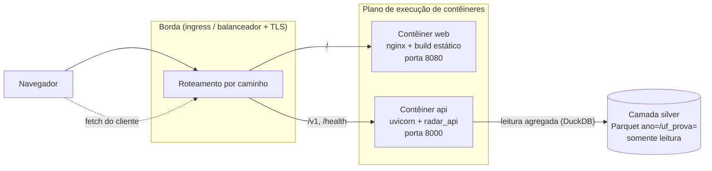

# Implantação e conformidade — Radar ENEM (API de análise + frontend)

Documento operacional da feature `radar-enem-analise-api`. Cobre topologia, configuração,
provisão da camada *silver*, *health checks*, envelope de erros, envelope de desempenho,
conformidade/privacidade (RIPD) e operação.

Atende aos requisitos **7.2** (recursos e estimativa de custo), **7.3** (provisão da *silver* ao
contêiner), **7.4** (topologia neutra em fornecedor) e **9.4** (nota RIPD).

> **Regra deste documento:** só há aqui afirmações verificadas no repositório ou medidas na máquina
> de desenvolvimento. O que não foi medido está marcado explicitamente como **a medir**. Nenhum
> número de *benchmark* ou de preço foi inventado.

---

## 1. Topologia

Três peças, sendo uma delas externa ao sistema:

- **API** — pacote Python `radar_api` (FastAPI + DuckDB embarcado), *stateless*. Entrypoint ASGI
  `radar_api.app:app`.
- **Frontend** — aplicação React 19 + Vite (TypeScript), compilada para arquivos **estáticos** e
  servida por nginx. Não há processo Node em produção. Conhece a API apenas por uma URL base HTTP.
- **Camada *silver*** — Parquet particionado, **contrato de entrada externo**. Não é construída nem
  escrita por este sistema: é **montada** no contêiner da API em tempo de execução, somente leitura.



Observações que afetam a topologia:

- O `fetch` para a API sai do **navegador**: o frontend é uma aplicação de página única e não tem
  servidor próprio para intermediar. Logo a URL da API precisa ser alcançável pelo cliente final.
- **Não há middleware de CORS na aplicação FastAPI** (verificado: nenhuma chamada a
  `add_middleware`/`CORSMiddleware` em `api/src`). Portanto, coloque frontend e API **na mesma
  origem**, roteando por caminho na borda (`/` → web, `/v1` e `/health` → api). Servir os dois em
  origens distintas exige adicionar CORS na API — uma mudança de código, não de configuração.
- Não há banco de dados, cache, fila ou volume de escrita. Ambos os contêineres podem ser
  reiniciados ou escalados horizontalmente sem coordenação.

---

## 2. Artefatos de implantação

| Artefato | Contexto de build | Porta | Processo |
|---|---|---|---|
| `api/Dockerfile` | `api/` | 8000 (`PORT`) | `uvicorn radar_api.app:app` |
| `web/Dockerfile` | `web/` | 8080 | `nginx` servindo `dist/` |

Os dois Dockerfiles são **a fonte de verdade** sobre o empacotamento; o que segue é o resumo
operacional deles (lido dos arquivos):

- Ambos são multiestágio e rodam como **usuário não-root** (`radar`, uid 1001, na API; o usuário
  já embutido em `nginx-unprivileged`, uid 101, no frontend).
- A imagem da API **não contém dados**: nenhum Parquet é copiado. `/data/silver` não é pré-criado
  de propósito — sem a montagem, o `/health` responde 503 em vez de simular uma *silver* vazia.
- A imagem da API traz apenas as dependências de runtime (`duckdb`, `fastapi`, `pydantic`,
  `pydantic-settings`, `uvicorn[standard]`); o extra `dev` (ruff/pytest/hypothesis/httpx) fica fora.
- A imagem do frontend contém **apenas o conteúdo de `dist/`** servido por nginx: nem Node, nem
  `npm`, nem `node_modules`, nem código TypeScript chegam à imagem final (~76 MB).
- O nginx do frontend faz *fallback* para `index.html` em qualquer rota não-arquivo
  (`web/nginx.conf`): sem isso, recarregar a página em `/panorama` ou `/comparativo` daria 404,
  porque essas rotas só existem no roteador do cliente.
- Ambas declaram `HEALTHCHECK`. O da API trata **200 e 503 como saudáveis** e só marca *unhealthy*
  quando o HTTP não responde — reiniciar o processo não conserta uma montagem ausente. A distinção
  200/503 é para a *readiness probe* do orquestrador (seção 6).

### Build e execução

```bash
# API — a silver é montada, nunca embutida
docker build -t radar-api:0.1.0 api/
docker run --rm -p 8000:8000 \
  -v /caminho/absoluto/para/data/silver:/data/silver:ro \
  -e RADAR_AMBIENTE_REFERENCIA=prod-ref \
  radar-api:0.1.0

# Frontend — a URL da API entra no BUILD (ver seção 4)
docker build -t radar-web:0.1.0-prod \
  --build-arg VITE_API_URL=https://radar.exemplo.org web/
docker run --rm -p 8080:8080 radar-web:0.1.0-prod
```

---

## 3. Pré-requisitos e execução local

| Componente | Pré-requisito | Origem verificada |
|---|---|---|
| API | Python ≥ 3.12 (dev local usa 3.12.3) | `api/pyproject.toml` (`requires-python = ">=3.12"`) |
| Frontend | Node ≥ 20 (imagem usa 22.13 alpine) | `web/package.json` (`engines.node`), `web/Dockerfile` |
| Contêineres | Docker (ou runtime OCI equivalente) | — |
| Dados | Camada *silver* legível (seção 5) | — |

```bash
# API (desenvolvimento)
cd api
python -m venv .venv && .venv/bin/pip install -e '.[dev]'
RADAR_SILVER_ROOT=../data/silver .venv/bin/uvicorn radar_api.app:app --reload --port 8000

# Qualidade (API): 255 testes coletados (pytest + hypothesis) e lint sem achados
.venv/bin/python -m pytest
.venv/bin/python -m ruff check .

# Frontend (desenvolvimento)
cd web
npm ci
cp .env.example .env.local     # VITE_API_URL=http://localhost:8000
npm run dev                    # http://localhost:5173
npm run typecheck && npm test
```

Sem `RADAR_SILVER_ROOT`, a API cai no padrão de desenvolvimento `<raiz-do-repo>/data/silver`,
derivado da localização do próprio pacote (`api/src/radar_api/config.py`). Em produção, **sempre**
defina a variável explicitamente.

---

## 4. Configuração

### 4.1 API — variáveis `RADAR_*`

Toda a configuração da API vem do ambiente, com prefixo `RADAR_` (mapeamento 1:1 com os campos de
`Config` em `api/src/radar_api/config.py`; nomes são *case-insensitive*; um arquivo `.env` no
diretório de trabalho também é lido — em contêiner, `/app`).

| Variável | Significado | Padrão (código) | Padrão na imagem | Efeito de alterar |
|---|---|---|---|---|
| `RADAR_SILVER_ROOT` | Raiz da camada *silver* (Parquet particionado) | `<raiz-do-repo>/data/silver` | `/data/silver` | Aponta o motor de consulta para outro conjunto de dados. Caminho inacessível ⇒ `/health` 503 e nenhuma edição listada. |
| `RADAR_MANIFESTOS_ROOT` | Raiz dos manifestos (linhagem) | `= silver_root` | herda `silver_root` | Permite servir manifestos de um local separado dos Parquet. Ausente ⇒ linhagem nula (não é erro). |
| `RADAR_LIMIAR_AGREGACAO` | **Controle de privacidade**: mínimo de linhas para divulgar um agregado (k-anonimato) | `25` | `25` | **Não é botão de desempenho.** Reduzir amplia o risco de reidentificação por recorte pequeno; aumentar suprime mais recortes. Ver seção 8. |
| `RADAR_ML_HABILITADO` | Habilita o Modelo_ML opcional | `false` | `false` | O núcleo estatístico não depende dele. O endpoint `POST /v1/ml/inferencia` **ainda não está registrado** na aplicação (verificado em `app.py`), então hoje a variável não muda comportamento observável. |
| `RADAR_ML_ARTEFATO` | Caminho do artefato do Modelo_ML | vazio | não definido | Idem acima. Se usado, precisa de montagem própria (ex.: `/data/ml/...`, somente leitura). |
| `RADAR_TIMEOUT_CONSULTA_S` | Timeout de consulta, em segundos | `30` | `30` | **Declarativo hoje**: o valor é lido pela configuração, mas nenhum caminho de código o aplica ao motor de consulta (verificado: nenhuma referência a `timeout_consulta_s` fora de `config.py`). O corte efetivo de 30 s existe **no cliente do frontend** (`web/lib/api.ts`, `TIMEOUT_MS = 30_000`), que aborta a requisição. Ao mudar o valor aqui, ajuste o cliente também. |
| `RADAR_AMBIENTE_REFERENCIA` | Rótulo do ambiente de referência (Req 6.3) | `local` | `container` | Apenas rotulagem: aparece em `GET /health` para identificar de qual ambiente vêm as medições de latência. |
| `PORT` | Porta HTTP do uvicorn | — | `8000` | Porta exposta pelo processo; o `HEALTHCHECK` da imagem usa a mesma variável. |

Campos desconhecidos no ambiente são ignorados (`extra="ignore"`), então prefixar outras variáveis
com `RADAR_` não quebra a inicialização. **A API não usa credenciais nem segredos.**

### 4.2 Frontend — `VITE_API_URL`

| Variável | Significado | Padrão | Natureza |
|---|---|---|---|
| `VITE_API_URL` | URL base da API consumida pelo navegador | `http://localhost:8000` | **Tempo de build** |

`VITE_*` é **substituído literalmente no bundle** pelo `vite build`. Consequências operacionais,
documentadas também no cabeçalho de `web/Dockerfile`:

- Definir a variável em `docker run` **não** altera o JavaScript já compilado que roda no navegador.
- A imagem do frontend é **específica do ambiente**: trocar a URL da API exige **reconstruir** a
  imagem (`--build-arg VITE_API_URL=...`). Na prática, uma imagem por ambiente, com a URL
  refletida na tag.
- Alternativa (não implementada): servir um `config.json` ao lado do `index.html` e buscá-lo no
  boot da aplicação, o que tornaria a URL uma configuração de runtime e permitiria uma única imagem
  para todos os ambientes — ao custo de um ida-e-volta antes da primeira requisição útil.

O contêiner não tem variáveis de runtime: a porta é fixa em 8080 e o nginx não lê ambiente.

---

## 5. A camada *silver* como contrato de entrada (Req 7.3)

### 5.1 Layout esperado

```
<RADAR_SILVER_ROOT>/
  ano=2023/uf_prova=AC/*.parquet
  ano=2023/uf_prova=AL/*.parquet
  ...
  ano=2024/uf_prova=.../*.parquet
  ano=2025/uf_prova=.../*.parquet
```

Particionamento Hive-style por `ano` e depois `uf_prova`, exatamente como o ETL da Sprint 1
materializa. A API descobre as edições varrendo diretórios `ano=<YYYY>` — nada é codificado.

### 5.2 Como disponibilizar ao contêiner

Os Parquet **não** entram na imagem. Montagens previstas pela imagem da API:

| Ponto de montagem | Variável | Obrigatório | Modo |
|---|---|---|---|
| `/data/silver` | `RADAR_SILVER_ROOT` | sim, em produção | somente leitura |
| `/data/manifestos` | `RADAR_MANIFESTOS_ROOT` | não (padrão = *silver*) | somente leitura |
| `/data/ml/...` | `RADAR_ML_ARTEFATO` | não (só com ML habilitado) | somente leitura |

Padrões neutros em fornecedor, em ordem de simplicidade:

1. **Volume/bind mount** com uma cópia local dos Parquet (o que os exemplos de `docker run` usam).
2. **Armazenamento de objetos sincronizado para um volume** por um *job* de sincronização, com a API
   lendo do sistema de arquivos. Preferido em nuvem: mantém a leitura local (rápida) e desacopla a
   atualização de dados do ciclo de vida da imagem.
3. **Bucket montado como sistema de arquivos** (driver CSI/FUSE). Funciona, mas a latência por
   arquivo é sensivelmente pior — se adotado, meça antes de assumir o alvo de latência da seção 7.

Atualizar dados é **trocar o conteúdo da montagem**, nunca reconstruir a imagem. O processo só lê;
montar somente leitura é a configuração correta e também garante que o sistema não possa alterar a
*silver*. O usuário do contêiner é uid 1001 — as permissões da montagem precisam permitir leitura
por ele.

### 5.3 Degradação quando a *silver* está ausente ou parcial

Comportamento verificado no código, não aspiracional:

| Situação | Resposta |
|---|---|
| Raiz inacessível/inexistente | `GET /health` → **503** `{"status":"degradado","silver_acessivel":false,"edicoes":[]}`. Nunca lança exceção. |
| Raiz vazia | `GET /v1/edicoes` → `[]` (lista vazia, **não** erro: não há edição a listar). |
| Edição pedida não existe | **404** `EDICAO_AUSENTE`. |
| Manifesto ausente/ilegível | A edição **continua listada**, com `manifesto_id` e `data_carga` iguais a `null`. A falta de linhagem nunca esconde a edição. |
| Capacidade indeterminável (Parquet ilegível) | Edição **omitida** de `GET /v1/edicoes`; `GET /v1/edicoes/{edicao}/capacidade` **propaga** 409 `CAPACIDADE_INDETERMINADA`. |

**Estado atual do ambiente de desenvolvimento:** o pacote `radar_etl` (ETL da Sprint 1) **não é
importável** neste ambiente e não há arquivos de manifesto na *silver*. Consequência medida: as três
edições são listadas normalmente, com `manifesto_id = null` e `data_carga = null`. Isso é a
degradação graciosa funcionando, não um defeito — mas significa que **a linhagem exibida ao usuário
(Req 5.3) fica vazia até que os manifestos sejam publicados junto dos Parquet**. Se a linhagem é
requisito da implantação, inclua os manifestos na montagem (`RADAR_MANIFESTOS_ROOT`).

### 5.4 Capacidade por edição (derivada, não codificada)

A capacidade é **derivada** — do contrato canônico quando `radar_etl` está disponível, e dos
próprios dados como *fallback* (uma dimensão é suportada se a coluna existe e tem ao menos um valor
não nulo). Tabela abaixo **medida** na *silver* local via `Catalogo.capacidade()`:

| Edição | Possui notas | `perfil_combinavel_com_notas` | Dimensões suportadas |
|---|---|---|---|
| 2023 | sim | **sim** | `regiao`, `uf_prova`, `tipo_escola`, `dependencia_adm_escola`, `renda_familiar`, `cor_raca`, `escolaridade_pai`, `escolaridade_mae` |
| 2024 | sim | **não** | `regiao`, `uf_prova`, `dependencia_adm_escola` |
| 2025 | **não** | não | `regiao`, `uf_prova`, `renda_familiar`, `cor_raca`, `escolaridade_pai`, `escolaridade_mae` |

Os nomes acima são os valores do enum `Dimensao` da API (`renda_familiar`, `escolaridade_pai`,
`escolaridade_mae` correspondem às colunas brutas `Q006`, `Q001`, `Q002` do INEP).

> **Desvio conhecido entre requisito e dados materializados.** O Req 2.1 lista `tipo_escola` como
> suportado em 2024. Na *silver* materializada, essa coluna está **inteiramente nula** em 2024, então
> a capacidade derivada a reporta como **não suportada** — e um recorte por `tipo_escola` em 2024 é
> recusado com `RECORTE_INDISPONIVEL`. Isso é consequência direta de AD-3 (capacidade derivada dos
> dados/contrato, nunca codificada): a API nunca promete um cruzamento que os dados não sustentam.
> A divergência está no texto do requisito, não no comportamento. Resolvê-la é decisão de produto:
> ou o requisito é ajustado, ou a extração de 2024 passa a popular `tipo_escola`.

---

## 6. Health check e *probes*

`GET /health` (verificado em `app.py`):

| Condição | Status | Corpo |
|---|---|---|
| Raiz da *silver* legível | **200** | `{"status":"ok","silver_acessivel":true,"edicoes":[2023,2024,2025],"ambiente_referencia":"..."}` |
| Raiz inacessível | **503** | `{"status":"degradado","silver_acessivel":false,"edicoes":[],"ambiente_referencia":"..."}` |

O endpoint **nunca lança exceção**: qualquer erro de sistema de arquivos é tratado como
"inacessível". A semântica é de **readiness**, não de liveness — 503 significa "vivo, porém sem
dados para servir".

Como ligar as *probes*:

- **Liveness** → o processo responde HTTP. Aceite **200 e 503** como vivo. Reiniciar o contêiner não
  conserta uma montagem ausente; matar réplicas saudáveis por causa de dados ausentes só transforma
  um problema de dados em uma indisponibilidade total.
- **Readiness** → exija **200**. Assim a réplica sai do balanceador enquanto a *silver* não estiver
  montada, e volta sozinha quando estiver.

```yaml
# Exemplo neutro (Kubernetes); adapte ao seu orquestrador.
livenessProbe:
  httpGet: { path: /health, port: 8000 }
  failureThreshold: 3
  periodSeconds: 30
readinessProbe:
  httpGet: { path: /health, port: 8000 }   # só 2xx conta como pronto
  periodSeconds: 10
```

Se o seu orquestrador não distingue liveness de readiness e trata 503 como falha fatal, use um alvo
TCP (porta 8000) para liveness e `/health` para readiness.

O frontend não expõe endpoint próprio de saúde; o `HEALTHCHECK` da imagem apenas verifica que `/`
responde.

---

## 7. Envelope de erros

**Toda** resposta de erro da API usa o envelope legível por máquina
`{"codigo": ..., "mensagem": ..., "detalhes": {...}}`. O formato `{"detail": ...}` padrão do FastAPI
**não** é emitido — inclusive falhas de validação são traduzidas. Clientes devem decidir por
`codigo`, nunca por texto.

| `codigo` | HTTP | Situação | `detalhes` úteis |
|---|---|---|---|
| `NOTA_FORA_INTERVALO` | 422 | Nota fora de 0–1000 (ou não numérica) | `minimo`, `maximo`, `nota` |
| `AREA_INVALIDA` | 422 | Área fora de `cn`/`ch`/`lc`/`mt`/`redacao` | `areas_validas`, `area` |
| `REQUISICAO_INVALIDA` | 422 | Outro campo inválido (ex.: `edicao` não inteira, `edicoes` vazia) | `violacoes[]` |
| `RECORTE_INDISPONIVEL` | 409 | Dimensão não suportada pela edição | `dimensao`, `edicao`, **`edicoes_que_suportam`** |
| `EDICAO_SEM_NOTAS` | 409 | Análise de nota pedida para edição sem notas (2025) | `edicao` |
| `PERFIL_NOTA_NAO_COMBINAVEL` | 409 | Perfil socioeconômico + nota na mesma edição (2024) | `edicao`, `dimensao` |
| `COMPARACAO_SEM_EDICOES_ELEGIVEIS` | 409 | Nenhuma edição suporta recorte + área | `edicoes` |
| `MANIFESTO_INVALIDO` | 409 | Manifesto presente porém ilegível | `edicao` |
| `CAPACIDADE_INDETERMINADA` | 409 | Contrato/dados não permitem derivar a capacidade | `edicao` |
| `EDICAO_AUSENTE` | 404 | Edição não existe na *silver* | `edicao` |
| `MANIFESTO_AUSENTE` | 404 | Manifesto não encontrado | `edicao` |
| `ML_DESABILITADO` / `ML_INDISPONIVEL` | 409 | Modelo_ML não oferecido nesta implantação | `ml_habilitado` |

Princípio do mapeamento: validação de entrada → 422; violação de capacidade → 409; recurso ausente
→ 404. Os dois códigos de ML existem na taxonomia, mas **o endpoint `POST /v1/ml/inferencia` ainda
não está registrado** na aplicação.

Casos que **não** são erro e chegam como **200**:

- Amostra insuficiente (abaixo do limiar): `estatisticamente_insuficiente = true`, com
  `distribuicao`, `percentil` e `tamanho_amostral` nulos.
- Ausência de linhagem: `manifesto_id`/`data_carga` nulos.

Para monitoração, uma regra prática: 409/404/422 são **respostas de contrato** (o cliente pediu algo
que os dados não sustentam) e não devem disparar alerta de disponibilidade; 5xx e 503 no `/health`,
sim.

### Rotas registradas hoje

| Método | Caminho |
|---|---|
| `POST` | `/v1/analise` |
| `POST` | `/v1/comparacao` |
| `GET` | `/v1/edicoes` |
| `GET` | `/v1/edicoes/{edicao}/capacidade` |
| `GET` | `/health` |

O FastAPI também publica a especificação OpenAPI (`/openapi.json` e `/docs`) — se a exposição
pública da documentação não for desejada, bloqueie esses caminhos na borda.

---

## 8. Envelope de desempenho (Req 6.3)

### 8.1 Volume dos dados (medido na *silver* local)

| Edição | Linhas | Parquet em disco |
|---|---|---|
| 2023 | 3.933.955 | ~30 MB |
| 2024 | 4.332.944 | ~22 MB |
| 2025 | 4.810.772 | ~1 MB |
| **Total** | **13.077.671** | **~53 MB** (81 arquivos) |

O volume é pequeno em bytes porque as colunas são majoritariamente categóricas (dicionário + RLE) e,
em 2025, as colunas de nota estão inteiramente nulas.

### 8.2 O que mantém a consulta limitada

- Leitura direta do Parquet via `read_parquet('<raiz>/ano=<edicao>/**/*.parquet',
  hive_partitioning = 1)`: o literal `ano=<edicao>` no caminho **poda a leitura para uma única
  partição de ano**; quando o recorte inclui `uf_prova`, o predicado induz poda também por UF.
- A projeção que sai do motor é **exclusivamente agregada** (contagens, quantis, faixas de
  histograma, percentil) — a edição inteira nunca é materializada na camada de aplicação.
- Handlers síncronos de propósito: as consultas DuckDB são bloqueantes e o FastAPI as executa em
  *threadpool*, sem travar o laço de eventos.

### 8.3 Ambiente de referência e alvo de latência

O alvo do Req 6.3 é **≤ 3 s para uma análise de recorte único no ambiente de referência
documentado**. O rótulo desse ambiente é `RADAR_AMBIENTE_REFERENCIA` e aparece em `GET /health`, para
que qualquer medição possa ser atribuída ao ambiente correto — inclusive as medições abaixo, que
foram feitas com o valor padrão `local`.

#### Onde os números abaixo foram medidos (máquina de desenvolvimento, **não** produção)

| Item | Valor observado |
|---|---|
| CPU | Intel Core i7-9750H @ 2.60 GHz, `os.cpu_count()` = 12 |
| Memória | 15 GB (máquina compartilhada com o desktop; não isolada) |
| Armazenamento da *silver* | volume local, disco ext4 (`/dev/sda4`) — **não** montagem de objeto/FUSE |
| Python / DuckDB | 3.12.3 / 1.5.5 |
| `RADAR_AMBIENTE_REFERENCIA` | `local` (padrão) |
| *Silver* medida | `data/silver` completa: 13.077.671 linhas, 81 Parquet (seção 8.1) |

**Estes são números de máquina de desenvolvimento, não do ambiente de referência de produção.**
Servem para mostrar a ordem de magnitude e para dar ao *smoke test* um limite não arbitrário; não
substituem uma medição no ambiente onde o serviço vai rodar. Ao implantar, meça de novo com o
`RADAR_AMBIENTE_REFERENCIA` daquele ambiente e registre aqui — um contêiner com 1 vCPU e a *silver*
em montagem remota se comporta diferente de 12 vCPU com disco local.

#### Latência medida (task 13.4 — `api/tests/test_desempenho.py`)

Cada cenário faz uma chamada de aquecimento (o tempo "frio") e depois 3 medições cronometradas com
`time.perf_counter()`; a tabela traz duas execuções do teste para dar ideia da variação.

| Cenário | Frio | Quente (mediana) | Quente (máx.) | Limite afirmado no teste |
|---|---|---|---|---|
| `analisar` — recorte único 2023/CN/`uf_prova=SP` (411.865 linhas) | 0,12–0,15 s | 0,12–0,14 s | 0,14 s | ≤ 3 s (alvo literal do Req 6.3) |
| `POST /v1/analise` — mesmo recorte, ponta a ponta pela borda HTTP | 0,24–0,25 s | 0,11–0,13 s | 0,13 s | ≤ 3 s |
| `analisar` — **sem** recorte, edição 2023 inteira (2.692.427 linhas) | 0,49–0,53 s | 0,43–0,45 s | 0,49 s | ≤ 6 s (2× o alvo, ver abaixo) |

Leitura desses números: o alvo de 3 s é cumprido com cerca de **20×** de folga no cenário do Req 6.3
nesta máquina. O caso sem recorte — o pedido mais caro que a API aceita (Req 1.3) — não é o cenário
do Req 6.3 e tem limite próprio de **2× o alvo**, um múltiplo documentado, não uma medição apertada.

O teste é um *smoke*, não um *benchmark*: os limites são generosos de propósito para detectar
regressão catastrófica (perda de poda, leitura da *silver* inteira) sem falhar porque a máquina ficou
ocupada. Ele é pulado quando `data/silver/ano=2023` não existe e leva o marcador `desempenho`
(`pytest -m desempenho` / `-m 'not desempenho'`).

#### Poda de partição verificada por estrutura, não por relógio (Req 6.2)

A guarda que não depende de relógio de parede está no mesmo teste: via `EXPLAIN ANALYZE` sobre o SQL
que a produção realmente emite, o recorte com `uf_prova=SP` lê **1 arquivo Parquet** contra **27** do
mesmo recorte sem UF (`Total Files Read`, edição 2023). Se o predicado de `uf_prova` deixar de ser
gerado ou de ser empurrado para o filtro de arquivo, as duas contagens se igualam em 27 e a asserção
falha — verificado simulando essa regressão.

**Ainda a medir:** p95 sob concorrência (as medições acima são sequenciais, um pedido por vez); pico
de memória do processo por consulta; efeito de montar a *silver* via FUSE/objeto em vez de volume
local; e a mesma tabela no ambiente de referência de produção, com o `RADAR_AMBIENTE_REFERENCIA`
correspondente.

Sobre o timeout: `RADAR_TIMEOUT_CONSULTA_S` é hoje **declarativo** (seção 4.1). Enquanto a
interrupção no motor não existir, o corte prático de 30 s é o do cliente do frontend; para uma
garantia de borda, configure também o timeout do *ingress*/balanceador.

### 8.4 Recursos necessários e custo (Req 7.2)

Dimensionamento inicial, neutro em fornecedor, para começar e depois ajustar com medição:

| Recurso | Ponto de partida | Observação |
|---|---|---|
| Contêiner API | 1–2 vCPU, 1–2 GB RAM, 1–2 réplicas | DuckDB usa CPU e memória proporcionais ao recorte, não ao tamanho da edição. *Stateless*: escala horizontal é trivial. |
| Contêiner web | 0,1–0,25 vCPU, 128 MB RAM, 1–2 réplicas | nginx servindo arquivos estáticos; sem estado. |
| Armazenamento da *silver* | ~53 MB medidos hoje (dimensione ~1 GB para folga e futuras edições) | Somente leitura; custo desprezível em qualquer provedor. |
| Borda | 1 balanceador/ingress com TLS | Normalmente o item de custo fixo mais relevante. |
| Rede | Egresso do JSON agregado (respostas de poucos KB) | Ordem de grandeza pequena; sem transferência de microdados. |
| Registro de imagens | Duas imagens pequenas | Custo por GB armazenado. |

Não há aqui valores monetários: preço por vCPU-hora, por GB e por balanceador variam por provedor,
região e data. Para a estimativa, componha os itens acima na calculadora do provedor escolhido —
**os direcionadores de custo dominantes são as horas de computação dos dois contêineres e o
balanceador**, não os dados. Se o custo precisar cair, a alavanca óbvia é usar um plano de
escala-a-zero para o frontend e réplica mínima única para a API em ambientes não produtivos.

---

## 9. Conformidade e privacidade (Req 9 / RIPD)

### 9.1 O que o sistema faz

- **Somente agregados.** A projeção que cruza a fronteira do motor de consulta contém apenas
  expressões agregadas — contagens, quantis, faixas de histograma e percentil. Nenhuma linha
  individual da *silver* é retornada a nenhum cliente, em nenhum endpoint. Isso é verificado por
  teste de propriedade (Property 6), não apenas por revisão.
- **k-anonimato.** `aplicar_limiar` suprime qualquer resultado cuja amostra seja menor que
  `RADAR_LIMIAR_AGREGACAO` (padrão **25**), anulando `distribuicao`, `percentil` **e**
  `tamanho_amostral`, e marcando `estatisticamente_insuficiente = true`. O tamanho suprimido também
  é nulo — de propósito: divulgar "n = 3" já é informação sobre um grupo minúsculo.
- **Proteção contra *differencing*.** A política existe e é testada por propriedade (Property 5):
  para dois recortes que diferem por um único filtro, `proteger_differencing` decide pela supressão
  de **ambos** quando a célula-diferença (`abs(n_a - n_b)`) é não vazia e menor que o limiar,
  impedindo reidentificação por subtração. **Ressalva honesta:** essa função ainda **não é chamada
  por nenhum caminho de requisição** (verificado: `nucleo.py` aplica `aplicar_limiar`, e nada em
  `api/src` invoca `proteger_differencing`). Hoje, portanto, a proteção efetiva por requisição é o
  limiar de k-anonimato; o ataque por subtração entre duas requisições vizinhas fica mitigado apenas
  indiretamente (ambos os recortes pequenos são suprimidos pelo limiar). Se o modelo de ameaça da
  implantação inclui sondagem sistemática, combine *rate limiting* na borda (seção 9.2) com a
  conclusão dessa integração.
- **Desidentificação do INEP respeitada.** Perfil socioeconômico e notas de 2024 **nunca** são
  unidos: em 2024 `perfil_combinavel_com_notas = false` (medido) e a combinação é recusada com
  `PERFIL_NOTA_NAO_COMBINAVEL`. Análises de nota para 2025 são recusadas com `EDICAO_SEM_NOTAS`,
  pois a edição não tem notas. Não existe caminho de código que tente reconstruir a identidade de
  participantes.
- **SQL parametrizado.** Valores de recorte são vinculados como parâmetros, nunca interpolados no
  texto da consulta; nomes de coluna vêm exclusivamente dos enums internos.
- **Nenhum dado pessoal atravessa a fronteira do serviço.** A nota informada pelo usuário é usada
  para calcular o percentil dentro da requisição e não é persistida — o sistema não tem banco de
  dados nem volume de escrita.

Nota RIPD (Req 9.4): **o Radar ENEM serve exclusivamente estatísticas agregadas dos microdados
públicos do ENEM, com supressão de agregados pequenos, e honra integralmente a desidentificação
aplicada pelo INEP em 2024 e 2025.** `RADAR_LIMIAR_AGREGACAO` é, portanto, um **parâmetro de
conformidade**: alterá-lo para baixo é uma decisão de privacidade que exige justificativa no RIPD,
não um ajuste de desempenho. Trate-o como configuração revisada, com valor registrado por ambiente.

### 9.2 A API é não autenticada — por decisão, não por esquecimento

Não há autenticação nem autorização na API, e isso é **deliberado** (registrado no cabeçalho de
`api/src/radar_api/app.py`): o serviço publica estatísticas agregadas de dados abertos, não há dados
por usuário a proteger e nenhum dado pessoal cruza a fronteira. Adicionar credenciais não protegeria
nada e criaria segredos para operar.

O que **é** responsabilidade da implantação colocar na frente do serviço:

- **TLS terminado na borda** e redirecionamento de HTTP para HTTPS.
- **Rate limiting** por IP no *ingress*/WAF. Este é o controle mais importante: cada requisição de
  análise é uma varredura agregada sobre milhões de linhas, então o risco real é **abuso de recurso**
  (e sondagem sistemática de recortes), não vazamento de dados.
- **Regras de rede**: exponha publicamente apenas a borda; a porta 8000 da API não deve ser
  alcançável diretamente de fora. Se web e API forem servidos na mesma origem por roteamento de
  caminho, a API não precisa de endereço público próprio.
- **Restrição de superfície**: considere bloquear `/docs` e `/openapi.json` na borda se a
  documentação não deve ser pública.
- **Origem única** (ou CORS explícito): sem middleware de CORS na aplicação, chamadas
  *cross-origin* do navegador serão bloqueadas (seção 1).
- **Montagem da *silver* somente leitura**, com permissão de leitura para uid 1001.

---

## 10. Operação

### 10.1 Logs

- **API**: uvicorn escreve *access log* e erros em stdout/stderr; `PYTHONUNBUFFERED=1` na imagem
  garante que nada fique retido em buffer. Variáveis `UVICORN_*` (ex.: `UVICORN_LOG_LEVEL`) são
  honradas pelo CLI. **Não há logging estruturado (JSON) nem correlação de requisições** implementado
  — colete o stdout do contêiner e, se precisar de campos estruturados, isso é trabalho a fazer.
- **Frontend**: o nginx da imagem escreve *access log* em stdout e erros em stderr. Como o
  frontend só serve arquivos estáticos, esses logs falam sobre entrega de assets — erro de
  aplicação acontece no navegador e não chega ao contêiner.
- Nenhum dos dois grava arquivos de log em disco; a coleta é responsabilidade do plano de execução.

### 10.2 Quando `/health` está `degradado` (503)

Percorra nesta ordem — a causa quase sempre é a montagem, não o processo:

1. `docker exec ... ls /data/silver` (ou o equivalente no orquestrador): o diretório existe e lista?
2. O valor efetivo de `RADAR_SILVER_ROOT` aponta para o **ponto de montagem** e não para um caminho
   do host? Confirme com `printenv | grep RADAR_`.
3. Permissões: o uid 1001 consegue ler o diretório e os arquivos?
4. O layout tem diretórios `ano=<YYYY>` no primeiro nível? Uma raiz que aponte um nível acima ou
   abaixo produz "acessível, porém sem edições".
5. Com 200 restabelecido, valide dados com `GET /v1/edicoes` (edições listadas, linhagem) e uma
   análise real em `POST /v1/analise`.

Sintomas relacionados: `EDICAO_AUSENTE` para uma edição que deveria existir ⇒ partição faltando na
montagem. `manifesto_id`/`data_carga` nulos ⇒ manifestos não montados (esperado hoje, seção 5.3).
Edição sumida de `/v1/edicoes` ⇒ Parquet ilegível; peça
`GET /v1/edicoes/{edicao}/capacidade` para ver o `CAPACIDADE_INDETERMINADA` explícito.

### 10.3 Rollback

Os dois contêineres são *stateless* e as imagens são imutáveis, então rollback é reimplantar a tag
anterior. Não há migração de banco a desfazer.

- **API**: reimplante a imagem anterior. Se o problema for de configuração e não de código, reverter
  a variável já resolve (ex.: `RADAR_LIMIAR_AGREGACAO` de volta a 25).
- **Frontend**: reimplante a imagem anterior. Lembre que a URL da API está **compilada** na imagem —
  o rollback do frontend também reverte a URL de API embutida.
- **Dados**: rollback de dados é apontar a montagem para a versão anterior da *silver*. Mantenha a
  *silver* anterior por um ciclo antes de descartá-la; assim o rollback é trocar montagem, não
  reprocessar o ETL. O `manifesto_id` (quando presente) é o identificador para saber qual carga está
  servindo.
- **Ordem sugerida** em implantação conjunta: suba a API primeiro (ela é retrocompatível com o
  frontend antigo enquanto o contrato de erros não muda), depois o frontend; no rollback, inverta.

---

## 11. Limitações conhecidas nesta versão

Registradas para não serem descobertas em produção:

1. `RADAR_TIMEOUT_CONSULTA_S` não é aplicado ao motor de consulta (só há o corte de 30 s no cliente
   do frontend).
2. Sem middleware de CORS: web e API precisam compartilhar a origem, ou a API precisa de código
   adicional.
3. `POST /v1/ml/inferencia` não está registrado; `RADAR_ML_HABILITADO` não tem efeito observável hoje.
4. Sem manifestos e sem `radar_etl` importável, a linhagem (`manifesto_id`, `data_carga`) volta nula.
5. `tipo_escola` em 2024 é reportado como não suportado, divergindo do texto do Req 2.1 (seção 5.4).
6. Alvo de latência de 3 s medido **apenas na máquina de desenvolvimento** (seção 8.3, *smoke test*
   `api/tests/test_desempenho.py`); ainda não medido no ambiente de referência de produção, nem sob
   concorrência.
7. Logging não estruturado e sem métricas/traços expostos (nenhum endpoint de métricas).
8. `proteger_differencing` implementado e testado, porém ainda não integrado ao caminho de
   requisição (seção 9.1).
